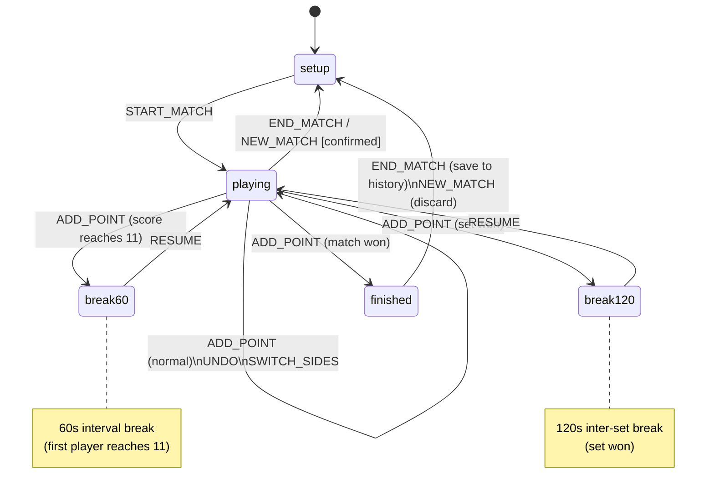
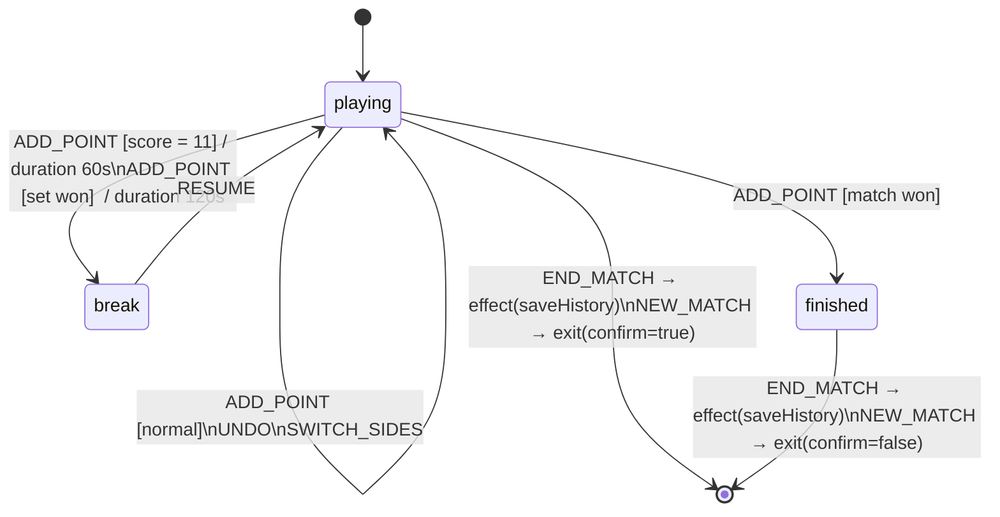

# 🏸 Birdi — Badminton Score Tracker


[](https://codecov.io/gh/sebaplaza/birdi)

A lightweight, offline-first web app for tracking badminton matches in real time.

> **⚠️ Heavy development** — features, data structures, and behaviour may change without notice. Expect rough edges.

**Live demo:** [sebaplaza.github.io/birdi](https://sebaplaza.github.io/birdi/)

---

## What it does

Birdi lets you score a badminton match point by point on any device, with no account or internet connection required.

### Match setup

- Enter two player names (with autocomplete from past matches)
- Choose the format: best of 1, 3, or 5 sets
- Choose points per set: 11, 15, or 21
- Choose who serves first

### Live scoring

- Large tap targets on the court visualization to score points
- Scoreboard with current set score, sets won, and serving indicator
- Set and total match timers
- Undo the last point at any time

### BWF rule enforcement

The app automatically handles the official rules:

- A set is won at the target score with a 2-point lead (e.g. 21-19)
- Deuce extends indefinitely until a 2-point lead is reached, capped at 30 points (30-29 wins)
- Match won when a player wins enough sets (e.g. 2 out of 3)
- Sides swap after each set
- In the deciding set, sides swap again when the leading score first reaches 11
- **60-second break** when a player reaches 11 points in a set
- **120-second break** between sets

### History

- Every finished match is saved locally to `localStorage`
- History panel shows date, players, score, winner, and duration
- Individual entries can be deleted, or the whole history cleared

### Customisation

- 10 color themes (Catppuccin, Nord, Dracula, Tokyo Night, Gruvbox, Monokai, Solarized…)
- 10 languages: English, French, Spanish, Danish, Chinese, Indonesian, Thai, Japanese, Malay, Hindi

### Offline-first

No server, no account, no telemetry. Everything runs in the browser and persists in `localStorage`.

---

## State machine

The app is driven by two finite state machines built on a small hand-rolled FSM library (`src/lib/fsm.ts`).

### Root FSM (`src/state.ts`)

Handles top-level routing and global events. In-game states are delegated to the game machine.



### Game machine (`src/game-fsm.ts`)

The sub-machine that handles all in-game logic. Uses `goto`, `exit`, and `effect` transitions from `src/lib/fsm.ts`.



### Transition types (`src/lib/fsm.ts`)

| Kind       | Meaning                                                  |
|------------|----------------------------------------------------------|
| `goto`     | Move to a new state                                      |
| `exit`     | Leave the machine (optionally ask for confirmation)      |
| `effect`   | Request a named side effect with data (e.g. save to storage) |

---

## Tech stack

| Concern         | Tool                   |
|-----------------|------------------------|
| Language        | TypeScript 5 (strict)  |
| Bundler         | Vite 7                 |
| Reactivity      | @preact/signals-core   |
| CSS framework   | PicoCSS v2             |
| Unit tests      | Vitest                 |
| E2E tests       | Playwright             |
| Linter          | oxlint                 |
| Formatter       | oxfmt                  |
| Package manager | pnpm 9                 |

No framework. The UI is built with a small hand-rolled reactive DOM layer on top of `@preact/signals-core`.

---

## Getting started

```bash
pnpm install
pnpm dev
```

Then open [localhost:5173](http://localhost:5173).

---

## Commands

| Command                | Description                            |
|------------------------|----------------------------------------|
| `pnpm dev`             | Start the dev server                   |
| `pnpm build`           | Production build (output in `dist/`)   |
| `pnpm preview`         | Preview the production build locally   |
| `pnpm test`            | Run unit tests (Vitest)                |
| `pnpm test:coverage`   | Run unit tests with coverage report    |
| `pnpm test:watch`      | Run unit tests in watch mode           |
| `pnpm test:e2e`        | Run end-to-end tests (Playwright)      |
| `pnpm lint`            | Lint source files                      |
| `pnpm lint:fix`        | Lint and auto-fix                      |
| `pnpm format`          | Format source files                    |
| `pnpm format:check`    | Check formatting without writing       |
